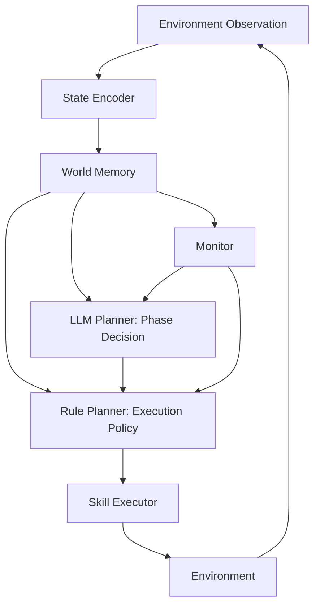

# Phase-Guided World Model Agent (PG-WMA)

## Problem

This project started from a simple assumption:

If an agent can decompose a task into steps, it should be able to solve it.

However, this turns out to be insufficient in partially observable environments.

The main issue is that the agent does not operate on fully interpretable states.  
Instead, it relies on latent representations that are not directly meaningful, and these are difficult for an LLM to reason about in a stable way.

As a result:

- step-level decomposition alone is not enough
- LLM decisions become inconsistent when grounded on weak representations
- execution can easily become unstable or inefficient

---

### Initial Direction: World Model

An early approach in this project was to introduce a learned world model (e.g., JEPA-style encoding) to bridge perception and planning.

The idea was to:

- encode observations into a structured latent space
- use that latent space for prediction and decision making

However, in practice, this approach faced several limitations:

- different interaction types often require separate learned predictors
- the system becomes increasingly complex as more events are introduced
- without a general-purpose world model, this approach does not scale well

---

### Current Direction

Given these constraints, the project shifts toward a more practical design.

Instead of relying on a fully learned world model, the system separates responsibilities:

- the LLM handles high-level phase decisions
- a memory module maintains a structured view of the environment
- a rule-based planner handles low-level execution

This design is more limited in generality, but more stable in practice.

---

### Summary

This project explores how to structure an agent when:

- the environment is partially observable
- the representation is imperfect
- and a general world model is not yet available

The goal is not to provide a general solution, but to study a workable intermediate design.

---

## Overview

This repository studies a practical agent architecture for partially observable, multi-stage tasks.

Instead of using a single policy to handle everything, the system separates:

- state representation
- memory construction
- high-level phase planning
- low-level execution

The current environment is a key-door-goal grid world, used as a controlled testbed for this architecture.



This architecture separates high-level reasoning from low-level control.  
The LLM selects the current phase, while the rule planner handles execution.

---

## Architecture

At the task level, the environment follows a structured dependency:

the agent must first obtain the key, then handle the door, and finally reach the goal.


These phases guide behavior but do not directly produce actions.  
The execution layer is responsible for movement and interaction.

---

### Core flow

`observation -> encoding -> memory update -> phase decision -> skill execution -> repeat`

---

### Components

#### 1. State Encoder
Converts observations into structured state:
- agent position
- local walls
- visible objects
- inventory state

#### 2. World Memory
Stores:
- visited positions
- known map structure
- object locations
- visit statistics

Also supports:
- BFS path planning
- frontier exploration
- loop detection

#### 3. LLM Planner
- outputs high-level phase only
- does NOT control movement

#### 4. Rule Planner
Handles:
- path following
- exploration
- local decision making

#### 5. Skill Executor
Executes:
- move
- scan
- escape_loop

#### 6. Monitor
Tracks:
- failure
- loops
- key events (key pickup, door open)

---

### Design principle

- LLM → decides what to do
- Rule system → decides how to do it

---

## Environment

Grid-world environment with:

- partial observability
- key-door-goal dependency
- walls and obstacles

---

## Results

| Setting | Success Rate | Average Steps |
|--------|-------------:|--------------:|
| 10x10, 7x7 view | 1.00 | 25.65 |
| 15x15, 7x7 view | 0.90 | 74.56 |

---

## Training (Predictor)

Includes scripts for:

- dataset collection
- MLP predictor training

Used for optional model-based planning.

---

## How to Run

```bash
python -m run.run_agent
```

---

## Project Structure

- agent/
- planner/
- memory/
- encoder/
- skills/
- env/
- monitor/
- run/
- scripts/
- visual/

---

## Future Work

- stronger world models
- larger environments
- multi-step prediction
- learned execution policies
