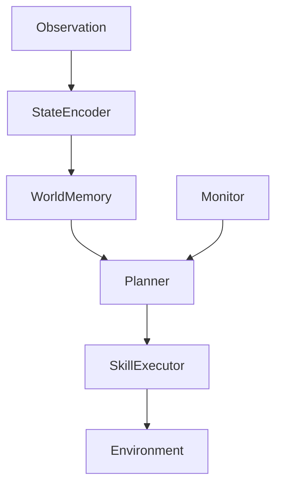

# Hybrid Planning Agent for Partial Observability (PG-WMA)

A modular agent system designed for stable decision-making under partial observability.

This project explores how to combine:

- structured state representation
- memory-based world reconstruction
- high-level planning (LLM)
- low-level execution (rule / predictive)

into a coherent and robust agent architecture.

---

## Core Idea

Instead of letting a single model handle everything:

LLM → decides WHAT to do  
Planner → decides HOW to do it  

This avoids:

- unstable token-level control
- poor reasoning over latent states
- excessive dependence on LLM

---

## System Architecture


- StateEncoder → structured latent state  
- WorldMemory → builds global map from partial observations  
- Planner  
  - LLM (slow): phase decision  
  - Rule / Predictive (fast): action execution  
- Monitor → controls stability and replanning  
- SkillExecutor → executes actions  

---

## Components

### StateEncoder

Transforms raw observation into structured state:

- agent position  
- local walls  
- visible objects  
- task state (key / door / goal)  

---

### WorldMemory

Maintains global understanding:

- visited positions  
- known walls / free cells  
- object memory (key / door / goal)  
- BFS path planning  

---

### Monitor

Handles control logic:

- detects oscillation / stuck states  
- triggers replanning  
- handles failure signals  

---

### Planner (Fast–Slow Design)

#### Slow planner (LLM)

Outputs high-level phase:

- find_key  
- go_to_door  
- search_goal  
- go_to_goal  
- recover  

---

#### Fast planner (Rule / Predictive)

Executes actions:

- BFS to known targets  
- frontier exploration  
- local fallback strategies  
- optional predictor rollout  

---

### Predictor (Optional)

Lightweight dynamics model:

- predicts next state  
- improves local decision quality  
- reduces trial-and-error exploration  

---

## Environment

Key-Door-Goal Grid World:

- partial observability (local view only)  
- multi-stage task:
  1. `find key`
  2. `open door`
  3. `reach goal`  

---

## Results

Example performance (20x20 grid):

- Success rate: ~98%  
- Average steps: ~100  

---

## How to Run

python run_agent.py

Optional modes (inside code):

- rule  
- predictive  
- llm_slow  
- hybrid (LLM + predictive)  

---

## Project Structure
```text
agent/
  agent_loop.py

encoder/
  state_encoder.py

memory/
  world_memory.py

planner/
  rule_planner.py
  predictive_planner_v8.py
  llm_planner.py

predictor/
  mlp_predictor.py
  jepa_lite_predictor.py

env/
  maze_env.py

skills/
  skill_executor.py
  move_k_steps_skill.py
  escape_loop_skill.py
  base_skill.py
  move_skill.py
  move_until_blocked_skill.py
  scan_skill.py

scripts/
  run_agent.py
  collect_predictor_dataset.py
  train_predictor.py
```

---

## Motivation

This project studies:

- how to stabilize LLM-based agents  
- how to separate planning and execution  
- how to use memory instead of full world models  
- how lightweight predictors improve decision-making  

---

## Key Insight

System design matters more than model size.

Even strong LLMs fail without:

- structured state  
- proper control flow  
- execution constraints  

---

## License

MIT
